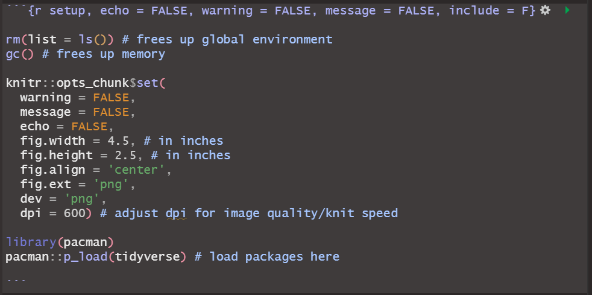

 

This R Markdown template is designed to typeset theses and dissertations
that conform to the requirements of Stellenbosch University. The
template is based on the file class, `usthesis`, created by Danie Els.
The relevant CTAN package can be found
[here](https://ctan.org/pkg/stellenbosch?lang=en). An example of a
thesis created using an older version of this template can be found
[here](https://scholar.sun.ac.za/bitstream/handle/10019.1/124624/marais_simulated_2022.pdf?sequence=1&isAllowed=y).

## Before You Start

-   On GitHub, click the **“Use this template”** button to import the
    source files on your own machine.

-   Make sure that you have the `TinyTeX` package installed and loaded
    in `R`. [Here](https://yihui.org/tinytex/) is a useful guide to
    `TinyTex`.

-   Feel free to contact me should you come across any issues.

## Repository Structure

The contents of this repo are as follows:

<table class="huxtable" style="border-collapse: collapse; border: 0px; margin-bottom: 2em; margin-top: 2em; ; margin-left: auto; margin-right: auto;  " id="tab:repostructure">
<col><col><tr>
<th colspan="2" style="vertical-align: top; text-align: center; white-space: normal; border-style: solid solid solid solid; border-width: 0.4pt 0.4pt 0.4pt 0.4pt; border-top-color: rgb(255, 255, 255);  border-right-color: rgb(255, 255, 255);  border-bottom-color: rgb(255, 255, 255);  border-left-color: rgb(255, 255, 255); padding: 6pt 6pt 6pt 6pt; background-color: rgb(229, 229, 229); font-weight: bold;">Important files in su_thesis_template</th></tr>
<tr>
<td style="vertical-align: top; text-align: left; white-space: normal; border-style: solid solid solid solid; border-width: 0.4pt 0.4pt 0.4pt 0.4pt; border-top-color: rgb(255, 255, 255);  border-right-color: rgb(255, 255, 255);  border-bottom-color: rgb(255, 255, 255);  border-left-color: rgb(255, 255, 255); padding: 6pt 6pt 6pt 6pt; background-color: rgb(242, 242, 242); font-weight: normal;">images\su_logo.jpg</td><td style="vertical-align: top; text-align: left; white-space: normal; border-style: solid solid solid solid; border-width: 0.4pt 0.4pt 0.4pt 0.4pt; border-top-color: rgb(255, 255, 255);  border-right-color: rgb(255, 255, 255);  border-bottom-color: rgb(255, 255, 255);  border-left-color: rgb(255, 255, 255); padding: 6pt 6pt 6pt 6pt; background-color: rgb(242, 242, 242); font-weight: normal;">index.pdf</td></tr>
<tr>
<td style="vertical-align: top; text-align: left; white-space: normal; border-style: solid solid solid solid; border-width: 0.4pt 0.4pt 0.4pt 0.4pt; border-top-color: rgb(255, 255, 255);  border-right-color: rgb(255, 255, 255);  border-bottom-color: rgb(255, 255, 255);  border-left-color: rgb(255, 255, 255); padding: 6pt 6pt 6pt 6pt; background-color: rgb(229, 229, 229); font-weight: normal;">abstract.Rmd</td><td style="vertical-align: top; text-align: left; white-space: normal; border-style: solid solid solid solid; border-width: 0.4pt 0.4pt 0.4pt 0.4pt; border-top-color: rgb(255, 255, 255);  border-right-color: rgb(255, 255, 255);  border-bottom-color: rgb(255, 255, 255);  border-left-color: rgb(255, 255, 255); padding: 6pt 6pt 6pt 6pt; background-color: rgb(229, 229, 229); font-weight: normal;">index.Rmd</td></tr>
<tr>
<td style="vertical-align: top; text-align: left; white-space: normal; border-style: solid solid solid solid; border-width: 0.4pt 0.4pt 0.4pt 0.4pt; border-top-color: rgb(255, 255, 255);  border-right-color: rgb(255, 255, 255);  border-bottom-color: rgb(255, 255, 255);  border-left-color: rgb(255, 255, 255); padding: 6pt 6pt 6pt 6pt; background-color: rgb(242, 242, 242); font-weight: normal;">acknowledgements.Rmd</td><td style="vertical-align: top; text-align: left; white-space: normal; border-style: solid solid solid solid; border-width: 0.4pt 0.4pt 0.4pt 0.4pt; border-top-color: rgb(255, 255, 255);  border-right-color: rgb(255, 255, 255);  border-bottom-color: rgb(255, 255, 255);  border-left-color: rgb(255, 255, 255); padding: 6pt 6pt 6pt 6pt; background-color: rgb(242, 242, 242); font-weight: normal;">mybib.bib</td></tr>
<tr>
<td style="vertical-align: top; text-align: left; white-space: normal; border-style: solid solid solid solid; border-width: 0.4pt 0.4pt 0.4pt 0.4pt; border-top-color: rgb(255, 255, 255);  border-right-color: rgb(255, 255, 255);  border-bottom-color: rgb(255, 255, 255);  border-left-color: rgb(255, 255, 255); padding: 6pt 6pt 6pt 6pt; background-color: rgb(229, 229, 229); font-weight: normal;">appendix.Rmd</td><td style="vertical-align: top; text-align: left; white-space: normal; border-style: solid solid solid solid; border-width: 0.4pt 0.4pt 0.4pt 0.4pt; border-top-color: rgb(255, 255, 255);  border-right-color: rgb(255, 255, 255);  border-bottom-color: rgb(255, 255, 255);  border-left-color: rgb(255, 255, 255); padding: 6pt 6pt 6pt 6pt; background-color: rgb(229, 229, 229); font-weight: normal;">su_thesis_template.Rproj</td></tr>
<tr>
<td style="vertical-align: top; text-align: left; white-space: normal; border-style: solid solid solid solid; border-width: 0.4pt 0.4pt 0.4pt 0.4pt; border-top-color: rgb(255, 255, 255);  border-right-color: rgb(255, 255, 255);  border-bottom-color: rgb(255, 255, 255);  border-left-color: rgb(255, 255, 255); padding: 6pt 6pt 6pt 6pt; background-color: rgb(242, 242, 242); font-weight: normal;">body.Rmd</td><td style="vertical-align: top; text-align: left; white-space: normal; border-style: solid solid solid solid; border-width: 0.4pt 0.4pt 0.4pt 0.4pt; border-top-color: rgb(255, 255, 255);  border-right-color: rgb(255, 255, 255);  border-bottom-color: rgb(255, 255, 255);  border-left-color: rgb(255, 255, 255); padding: 6pt 6pt 6pt 6pt; background-color: rgb(242, 242, 242); font-weight: normal;">ustemplate.tex</td></tr>
</table>

### `index.Rmd` and `index.pdf`

-   `index.Rmd` is arguably the most important file in the repository
    and should serve as the starting- and end-point of the user’s
    workflow.

-   Its purpose is to define the skeleton (or structure) and of the
    final document. The structure is partly determined by the main
    template file `ustemplate.tex`, which `index.Rmd` calls upon, and by
    the composition of “child” files (e.g., `body.Rmd` and
    `appendix.Rmd`) it specifies. Moreover, it enables the user to
    specify whether and from where to include abstracts,
    acknowledgements, lists of tables/figures/abbreviations, a
    nomenclature, and the source of the bibliography.

-   `index.Rmd` is also where the document’s metadata is defined; that
    is, details regarding the author, title, date, etc.. These
    specifications are made in the `YAML` at the top of the `index.Rmd`
    file. This information will automatically be reflected in the final
    document.

-   It is very useful to centralise the loading of packages and
    specification of default code chunk settings from this file. This
    can be done from the `setup` code chunk in `index.Rmd`, as
    illustrated below.

-   The final document is knitted from `index.Rmd`, and hence, will
    produce the final document titled `index.pdf`.

### `ustemplate.tex`

-   This $\TeX$ file contains the main substance of the template. It
    reflects the primary set of rules according to which the final
    document will be formatted. Apart from the recommended modifications
    below, I do not recommend that the user affect many major changes to
    this file.

<table class="huxtable" style="border-collapse: collapse; border: 0px; margin-bottom: 2em; margin-top: 2em; ; margin-left: auto; margin-right: auto;  " id="tab:templatemodifications">
<col><col><col><tr>
<th style="vertical-align: top; text-align: left; white-space: normal; border-style: solid solid solid solid; border-width: 0.4pt 0.4pt 0.4pt 0.4pt; border-top-color: rgb(255, 255, 255);  border-right-color: rgb(255, 255, 255);  border-bottom-color: rgb(255, 255, 255);  border-left-color: rgb(255, 255, 255); padding: 6pt 6pt 6pt 6pt; background-color: rgb(229, 229, 229); font-weight: bold;">Line(s)</th><th style="vertical-align: top; text-align: left; white-space: normal; border-style: solid solid solid solid; border-width: 0.4pt 0.4pt 0.4pt 0.4pt; border-top-color: rgb(255, 255, 255);  border-right-color: rgb(255, 255, 255);  border-bottom-color: rgb(255, 255, 255);  border-left-color: rgb(255, 255, 255); padding: 6pt 6pt 6pt 6pt; background-color: rgb(229, 229, 229); font-weight: bold;">Description</th><th style="vertical-align: top; text-align: left; white-space: normal; border-style: solid solid solid solid; border-width: 0.4pt 0.4pt 0.4pt 0.4pt; border-top-color: rgb(255, 255, 255);  border-right-color: rgb(255, 255, 255);  border-bottom-color: rgb(255, 255, 255);  border-left-color: rgb(255, 255, 255); padding: 6pt 6pt 6pt 6pt; background-color: rgb(229, 229, 229); font-weight: bold;">Option</th></tr>
<tr>
<td style="vertical-align: top; text-align: left; white-space: normal; border-style: solid solid solid solid; border-width: 0.4pt 0.4pt 0.4pt 0.4pt; border-top-color: rgb(255, 255, 255);  border-right-color: rgb(255, 255, 255);  border-bottom-color: rgb(255, 255, 255);  border-left-color: rgb(255, 255, 255); padding: 6pt 6pt 6pt 6pt; background-color: rgb(242, 242, 242); font-weight: normal;">12</td><td style="vertical-align: top; text-align: left; white-space: normal; border-style: solid solid solid solid; border-width: 0.4pt 0.4pt 0.4pt 0.4pt; border-top-color: rgb(255, 255, 255);  border-right-color: rgb(255, 255, 255);  border-bottom-color: rgb(255, 255, 255);  border-left-color: rgb(255, 255, 255); padding: 6pt 6pt 6pt 6pt; background-color: rgb(242, 242, 242); font-weight: normal;">Dictates whether the template should conform to the requirements of a Master's thesis or PhD dissertation.</td><td style="vertical-align: top; text-align: left; white-space: normal; border-style: solid solid solid solid; border-width: 0.4pt 0.4pt 0.4pt 0.4pt; border-top-color: rgb(255, 255, 255);  border-right-color: rgb(255, 255, 255);  border-bottom-color: rgb(255, 255, 255);  border-left-color: rgb(255, 255, 255); padding: 6pt 6pt 6pt 6pt; background-color: rgb(242, 242, 242); font-weight: normal;">`masters-t` or `PhD`.</td></tr>
<tr>
<td style="vertical-align: top; text-align: left; white-space: normal; border-style: solid solid solid solid; border-width: 0.4pt 0.4pt 0.4pt 0.4pt; border-top-color: rgb(255, 255, 255);  border-right-color: rgb(255, 255, 255);  border-bottom-color: rgb(255, 255, 255);  border-left-color: rgb(255, 255, 255); padding: 6pt 6pt 6pt 6pt; background-color: rgb(229, 229, 229); font-weight: normal;">296-306</td><td style="vertical-align: top; text-align: left; white-space: normal; border-style: solid solid solid solid; border-width: 0.4pt 0.4pt 0.4pt 0.4pt; border-top-color: rgb(255, 255, 255);  border-right-color: rgb(255, 255, 255);  border-bottom-color: rgb(255, 255, 255);  border-left-color: rgb(255, 255, 255); padding: 6pt 6pt 6pt 6pt; background-color: rgb(229, 229, 229); font-weight: normal;">Defines the addresses of the institution in Afrikaans and English, which are displayed in the abstracts.</td><td style="vertical-align: top; text-align: left; white-space: normal; border-style: solid solid solid solid; border-width: 0.4pt 0.4pt 0.4pt 0.4pt; border-top-color: rgb(255, 255, 255);  border-right-color: rgb(255, 255, 255);  border-bottom-color: rgb(255, 255, 255);  border-left-color: rgb(255, 255, 255); padding: 6pt 6pt 6pt 6pt; background-color: rgb(229, 229, 229); font-weight: normal;">Change the text of the addresses to reflect that of your department.</td></tr>
<tr>
<td style="vertical-align: top; text-align: left; white-space: normal; border-style: solid solid solid solid; border-width: 0.4pt 0.4pt 0.4pt 0.4pt; border-top-color: rgb(255, 255, 255);  border-right-color: rgb(255, 255, 255);  border-bottom-color: rgb(255, 255, 255);  border-left-color: rgb(255, 255, 255); padding: 6pt 6pt 6pt 6pt; background-color: rgb(242, 242, 242); font-weight: normal;">321</td><td style="vertical-align: top; text-align: left; white-space: normal; border-style: solid solid solid solid; border-width: 0.4pt 0.4pt 0.4pt 0.4pt; border-top-color: rgb(255, 255, 255);  border-right-color: rgb(255, 255, 255);  border-bottom-color: rgb(255, 255, 255);  border-left-color: rgb(255, 255, 255); padding: 6pt 6pt 6pt 6pt; background-color: rgb(242, 242, 242); font-weight: normal;">Adds/removes co-supervisor to the cover page.</td><td style="vertical-align: top; text-align: left; white-space: normal; border-style: solid solid solid solid; border-width: 0.4pt 0.4pt 0.4pt 0.4pt; border-top-color: rgb(255, 255, 255);  border-right-color: rgb(255, 255, 255);  border-bottom-color: rgb(255, 255, 255);  border-left-color: rgb(255, 255, 255); padding: 6pt 6pt 6pt 6pt; background-color: rgb(242, 242, 242); font-weight: normal;">Uncomment or comment line with "%" to add and remove co-supervisor.</td></tr>
<tr>
<td style="vertical-align: top; text-align: left; white-space: normal; border-style: solid solid solid solid; border-width: 0.4pt 0.4pt 0.4pt 0.4pt; border-top-color: rgb(255, 255, 255);  border-right-color: rgb(255, 255, 255);  border-bottom-color: rgb(255, 255, 255);  border-left-color: rgb(255, 255, 255); padding: 6pt 6pt 6pt 6pt; background-color: rgb(229, 229, 229); font-weight: normal;">325</td><td style="vertical-align: top; text-align: left; white-space: normal; border-style: solid solid solid solid; border-width: 0.4pt 0.4pt 0.4pt 0.4pt; border-top-color: rgb(255, 255, 255);  border-right-color: rgb(255, 255, 255);  border-bottom-color: rgb(255, 255, 255);  border-left-color: rgb(255, 255, 255); padding: 6pt 6pt 6pt 6pt; background-color: rgb(229, 229, 229); font-weight: normal;">Defines a sponsorship disclaimer which appears on the cover page.</td><td style="vertical-align: top; text-align: left; white-space: normal; border-style: solid solid solid solid; border-width: 0.4pt 0.4pt 0.4pt 0.4pt; border-top-color: rgb(255, 255, 255);  border-right-color: rgb(255, 255, 255);  border-bottom-color: rgb(255, 255, 255);  border-left-color: rgb(255, 255, 255); padding: 6pt 6pt 6pt 6pt; background-color: rgb(229, 229, 229); font-weight: normal;">Uncomment or comment line with "%" to add and remove the sponsorhip disclaimer. Change the contents of the parentheses as needed.</td></tr>
<tr>
<td style="vertical-align: top; text-align: left; white-space: normal; border-style: solid solid solid solid; border-width: 0.4pt 0.4pt 0.4pt 0.4pt; border-top-color: rgb(255, 255, 255);  border-right-color: rgb(255, 255, 255);  border-bottom-color: rgb(255, 255, 255);  border-left-color: rgb(255, 255, 255); padding: 6pt 6pt 6pt 6pt; background-color: rgb(242, 242, 242); font-weight: normal;">336</td><td style="vertical-align: top; text-align: left; white-space: normal; border-style: solid solid solid solid; border-width: 0.4pt 0.4pt 0.4pt 0.4pt; border-top-color: rgb(255, 255, 255);  border-right-color: rgb(255, 255, 255);  border-bottom-color: rgb(255, 255, 255);  border-left-color: rgb(255, 255, 255); padding: 6pt 6pt 6pt 6pt; background-color: rgb(242, 242, 242); font-weight: normal;">Adds the watermark of the SU logo on the cover page.</td><td style="vertical-align: top; text-align: left; white-space: normal; border-style: solid solid solid solid; border-width: 0.4pt 0.4pt 0.4pt 0.4pt; border-top-color: rgb(255, 255, 255);  border-right-color: rgb(255, 255, 255);  border-bottom-color: rgb(255, 255, 255);  border-left-color: rgb(255, 255, 255); padding: 6pt 6pt 6pt 6pt; background-color: rgb(242, 242, 242); font-weight: normal;">Change the file path of the image you would like to use {./images/su_logo.jpg}, and raise and lower the logo {-2cm}. With longer titles, it may be required to further lower the logo, e.g., {-3.5cm}.</td></tr>
</table>

### `mybib.bib`

-   `mybib.bib` serves as only bibliography file for this template. It
    must have the standard `bibtex` syntax and the extension `.bib`. It
    contains a list of bibliography sources and several fields with
    information about each entry.

-   Add `bibtex` sources manually or have your reference management
    applications, such as
    [Zotero](https://gsverhoeven.github.io/post/zotero-rmarkdown-csl/),
    export and automatically update sources to the `mybib.bib` file.

-   As indicated in the `YAML` of `index.Rmd`, this template uses the
    `natbib` package to perform reference management and the
    customisation of your bibliography. It is not recommended that users
    alter these settings, as the template already adopts settings
    appropriate for Stellenbosch University requirements.

### `images\su_logo.jpg`

-   Image used for the logo on the cover page.

-   The folder `images` can also be used as the user’s directory for
    other images utilised in the document.

## `abstract.Rmd`

-   This file contains the objects for English and Afrikaans abstracts.
    These will appear in the final document after the plagiarism
    declaration.

-   Because these objects are given in a $\LaTeX$ environment, standard
    markdown syntax should be replaced with $\LaTeX$ syntax.

-   To create citations, for example, in `abstract.Rmd`, the user must
    use `\cite{marais2021}` (or similar) instead of `[@marais2021]`.

-   To remove the Afrikaans abstract (or “Uittreksel”), delete
    everything between and including `\begin{abstract}[afrikaans]` and
    `\end{abstract}`.

### `acknowledgements.Rmd`

-   This file contains the content of the author’s acknowledgements. It
    appears in the final document after the abstracts and before the
    table of contents.

-   As with `abstract.Rmd`, the acknowledgements object is given in a
    $\LaTeX$ environment. Therefore, the user must opt for the
    appropriate syntax. For example, lists are made using the
    `\begin{itemize}` and `\item` commands as opposed the syntax
    demanded by markdown.

## `body.Rmd` and `appendix.Rmd`

-   `body.Rmd` is intended to contain the main corpus of the thesis or
    dissertation; that is, from the introduction to the conclusion. It
    will appear after the List of Tables and before any appendices.

-   `appendix.Rmd` is intended to contain the content which will appear
    after the conclusion of the main body of text and before the list of
    references.

-   The user is able to use the full suite of Markdown and $\LaTeX$
    syntax throughout these files.

### `su_thesis_template.Rproj`

-   As always, users are encouraged to work on their thesis/dissertation
    `R` files from the project file ending with `.Rproj`. In other
    words, when restarting `RStudio`, users are should open the
    application from this file. This is more important than usual,
    because file paths important for the functioning of the template are
    fixed in relation to the directory where the `.Rproj` file is
    located.
